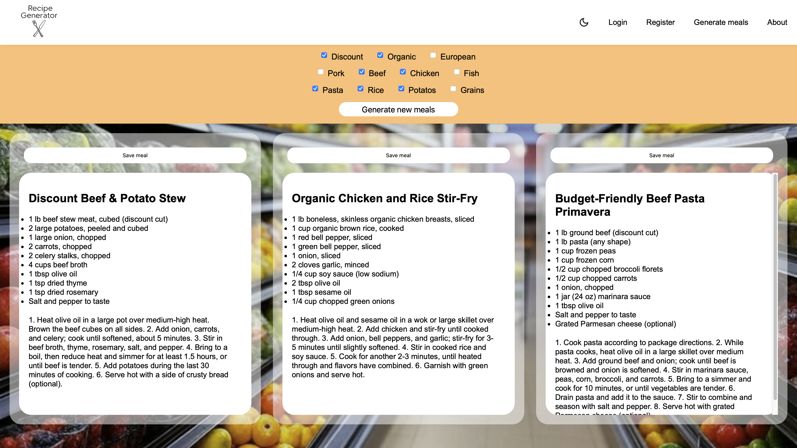

# Recipe Generator project

A full-stack web application for generating and saving personalized recipes.

## Tech Stack:

- **Frontend**: HTML, CSS, JavaScript
- **Backend**: Flask
- **Database**: PostgreSQL
- **LLM Integration**: Gemini API for recipe generation

## Features:

- User registration and login
- Recipe generation based on selected filters using the **Gemini API**
- Saving favorite meals to the user profile
- Generating personalized shopping lists based on saved meals

## Database: 

The app uses a PostgreSQL database with the following tables:
- `users` table – stores user credentials
- `meals` table – stores user-generated recipes

